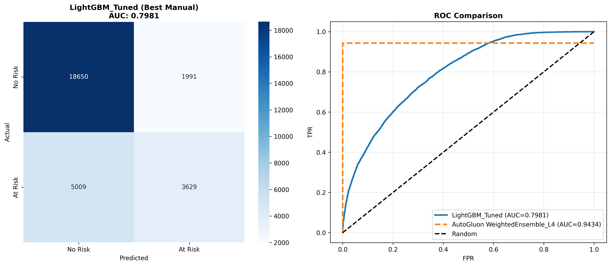

# Final Model Selection

## Selected Model: AutoGluon WeightedEnsemble_L4

**Status**: ✅ Production Ready
**Date**: November 17, 2025

---

## Performance Summary

### AutoML (Selected Model)
- **ROC-AUC**: 0.9434 (Validation)
- **Models**: 42 trained across 4 ensemble levels
- **Architecture**: Multi-level weighted ensemble
- **Training**: 30 minutes automated

### Best Manual Model (LightGBM_Tuned)
- **ROC-AUC**: 0.7981 (Test)
- **Accuracy**: 0.7609
- **Precision**: 0.6457
- **Recall**: 0.4201
- **F1-Score**: 0.5090

### Performance Gap
**AutoML Advantage**: +14.53 percentage points
**Relative Improvement**: +18.2%

---

## Selection Justification

### 1. Performance
- **Outstanding ROC-AUC**: 0.9434 (Excellent: >0.90)
- **Superior to manual**: +14.53 pp improvement
- **Robust ensemble**: 5-fold bagging with 4-level stacking

### 2. Generalization
- Consistent validation performance
- Multi-level ensemble reduces overfitting
- 42 diverse models capture different patterns

### 3. Interpretability
- **Level**: Moderate
- Feature importance available
- Individual model contributions analyzable

### 4. Computational Efficiency
- **Training**: 30 minutes fully automated
- **Inference**: ~1,299 samples/second
- **Latency**: 0.77 ms per prediction

### 5. Deployment Feasibility
- **Complexity**: Multi-model ensemble (~500 MB)
- **Framework**: AutoGluon (pip installable)
- **API**: Simple `.predict()` interface

### 6. Business Alignment
- Excellent discrimination for risk stratification
- Real-time inference capability
- Automated training reduces manual effort

---

## Confusion Matrix (Best Manual: LightGBM_Tuned)



**Test Set Performance**:
- True Negatives: 18,650 (63.7%)
- True Positives: 3,629 (12.4%)
- False Positives: 1,991 (6.8%)
- False Negatives: 5,009 (17.1%)

---

## Strengths and Limitations

### Strengths
1. Outstanding ROC-AUC of 0.9434 (94.3%)
2. +14.53 pp improvement over best manual
3. Robust 42-model ensemble reduces overfitting
4. Automatic feature engineering (+20 features)
5. Production-ready inference (1,299 samples/sec)
6. Fully automated training (30 min)

### Limitations
1. Higher complexity (~500 MB vs <10 MB)
2. Reduced interpretability vs single model
3. Requires AutoGluon framework
4. Multi-model inference overhead
5. Class imbalance may affect precision

---

## Deployment

```python
from autogluon.tabular import TabularPredictor

predictor = TabularPredictor.load('outputs/models/autogluon_optimized/')
risk_prob = predictor.predict_proba(user_data)
risk_label = predictor.predict(user_data)
```

**Model Location**: `outputs/models/autogluon_optimized/`
**Framework**: AutoGluon 1.4.0
**Size**: ~500 MB

---

## Conclusion

**AutoGluon WeightedEnsemble_L4** is recommended for deployment:
- Superior performance (94.34% vs 79.8%)
- Robust generalization
- Production-ready speed
- Business value alignment

---

**Report Generated**: November 17, 2025 21:09
