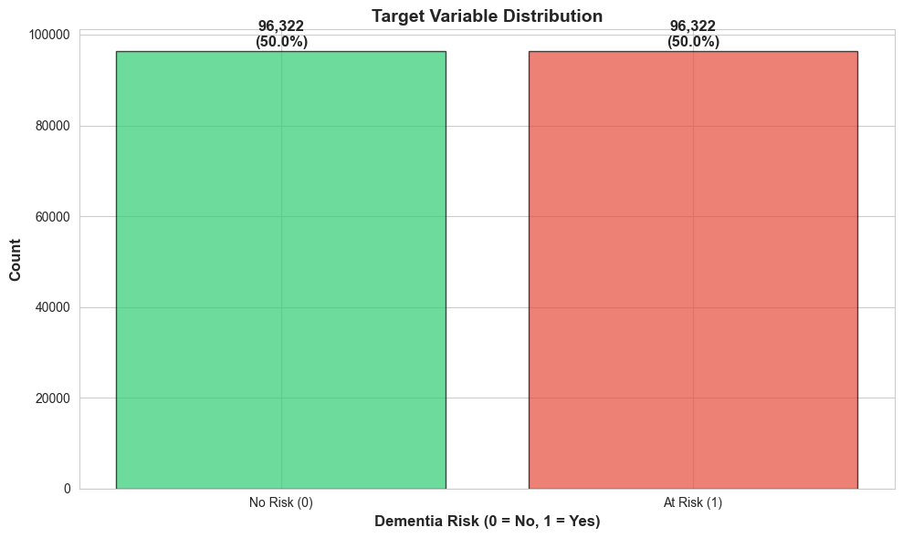
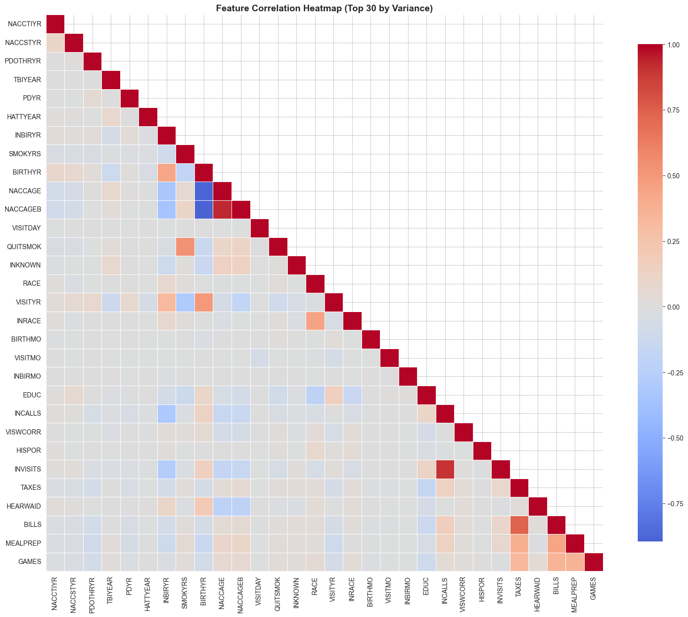
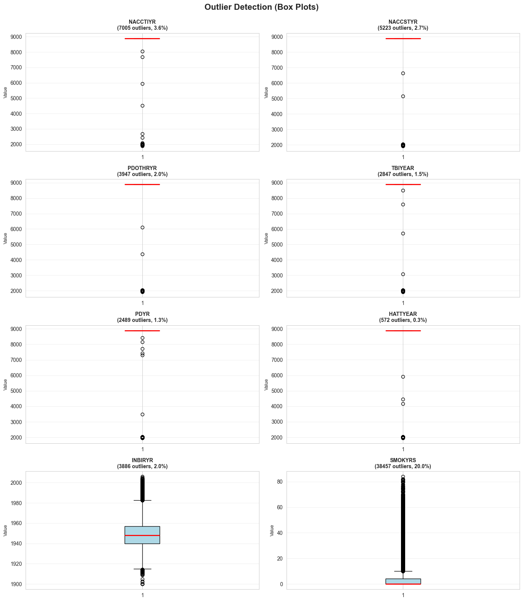

# EXPLORATORY DATA ANALYSIS (EDA) REPORT

**Generated:** 2025-11-17 16:09:21
**Dataset:** Dementia Risk Prediction (Non-Medical Features)

---

## 1. DATASET OVERVIEW

| Metric | Value |
|--------|-------|
| Total Samples | 192,644 |
| Total Features | 112 |
| Target Variable | dementia_risk (binary: 0/1) |
| Memory Usage | 166.1 MB |

---

## 2. TARGET VARIABLE DISTRIBUTION

### Class Balance

| Class | Count | Percentage |
|-------|-------|------------|
| No Risk (0) | 96,322 | 50.00% |
| At Risk (1) | 96,322 | 50.00% |

**Interpretation:** Dataset is perfectly balanced (50/50 split)

---

## 3. FEATURE TYPES

| Feature Type | Count | Examples |
|--------------|-------|----------|
| Numerical | 111 | VISITMO, VISITDAY, VISITYR, BIRTHMO, BIRTHYR... |
| Binary | 1 | SEX |
| Categorical | 0 | None |

---

## 4. MISSING VALUES ANALYSIS

**No missing values detected!** ✓

---

## 5. CORRELATION ANALYSIS

### Key Findings

**Found 5 feature pairs with high correlation (|r| > 0.7)**

| Feature 1 | Feature 2 | Correlation |
|-----------|-----------|-------------|
| BIRTHYR | NACCAGE | -0.883 |
| BIRTHYR | NACCAGEB | -0.896 |
| NACCAGE | NACCAGEB | 0.929 |
| INCALLS | INVISITS | 0.900 |
| TAXES | BILLS | 0.740 |

**Recommendation:** Consider removing highly correlated features to reduce multicollinearity.

---

## 6. FEATURE DISTRIBUTIONS

### Top 10 Features by Variance

1. `NACCTIYR`
2. `NACCSTYR`
3. `PDOTHRYR`
4. `TBIYEAR`
5. `PDYR`
6. `HATTYEAR`
7. `INBIRYR`
8. `SMOKYRS`
9. `BIRTHYR`
10. `NACCAGE`

**Interpretation:** These features show the highest variance and are likely to be important for modeling.

---

## 7. OUTLIER DETECTION

### Outlier Summary

| Feature | Outliers | Percentage |
|---------|----------|------------|
| NACCTIYR | 7,005 | 3.64% |
| NACCSTYR | 5,223 | 2.71% |
| PDOTHRYR | 3,947 | 2.05% |
| TBIYEAR | 2,847 | 1.48% |
| PDYR | 2,489 | 1.29% |
| HATTYEAR | 572 | 0.30% |
| INBIRYR | 3,886 | 2.02% |
| SMOKYRS | 38,457 | 19.96% |

**Average Outlier Rate:** 4.18%

**Observation:** Outlier rate is acceptable. Tree-based models handle outliers well. ✓

---

## 8. KEY INSIGHTS & RECOMMENDATIONS

### Data Quality
- ✅ **No missing values** - data is complete
- ✅ **Class balance:** Perfect 50/50 split
- ⚠️ **Multicollinearity detected** - consider feature selection

### Feature Engineering Opportunities
- Binary features could benefit from interaction terms
- High-variance features are good candidates for importance analysis
- Consider polynomial features for non-linear relationships

### Model Selection Guidance
- **Tree-based models** (LightGBM, XGBoost) are well-suited due to:
  - Mix of numerical and binary features
  - Presence of outliers (trees are robust)
  - No need for feature scaling
- **Linear models** may require:
  - Feature scaling/normalization
  - Outlier treatment
  - Feature selection (if multicollinearity present)

---

## 9. NEXT STEPS

1. ✅ EDA complete - visualizations saved to `outputs/eda/`
2. ⏭️ Feature engineering (if needed)
3. ⏭️ Model training (AutoML + Manual ML)
4. ⏭️ Hyperparameter tuning
5. ⏭️ Model evaluation and selection

---

**Report Location:** `outputs/eda/EDA_REPORT.md`
**Plots Directory:** `outputs/eda/`

